# Lab 01 — Microsoft Entra ID: Dynamic Groups & Conditional Access

**Tools:** Microsoft Entra ID (Azure AD) · Entra ID Premium P2 · Conditional Access · Microsoft Graph-backed user provisioning

**Domains:** Identity & Access Management · Attribute-Based Access Control · Zero Trust / Conditional Access · Microsoft SC-300 (Identity and Access Administrator)

---

## Problem

Manually maintaining group membership for a growing organization doesn't scale: every
new hire, transfer, or role change means someone has to remember to add or remove that
user from the right security groups by hand. That's both an operational burden and a
security risk — stale membership is one of the most common sources of access-review
findings. Separately, a cloud identity tenant with no adaptive access policy has no
enforcement point beyond a basic username/password check, which fails a Zero Trust
"never trust, always verify" posture.

## Solution

I built a 13-user, 6-department Entra ID tenant (`Houry Identity Solutions`) and solved
both problems with two native Entra ID controls:

- **Attribute-based dynamic security groups** — group membership is evaluated
  automatically from each user's `department` attribute, so provisioning a user
  correctly is the *only* action required; group membership requires zero manual
  upkeep after that.
- **A Conditional Access policy enforcing MFA for all users** — a Zero Trust
  control that requires explicit verification (multifactor authentication) at
  sign-in, independent of any per-user configuration, with the tenant's own
  admin account excluded as a **break-glass** account so the policy itself can
  never lock out the person who has to fix it.

### How access is evaluated

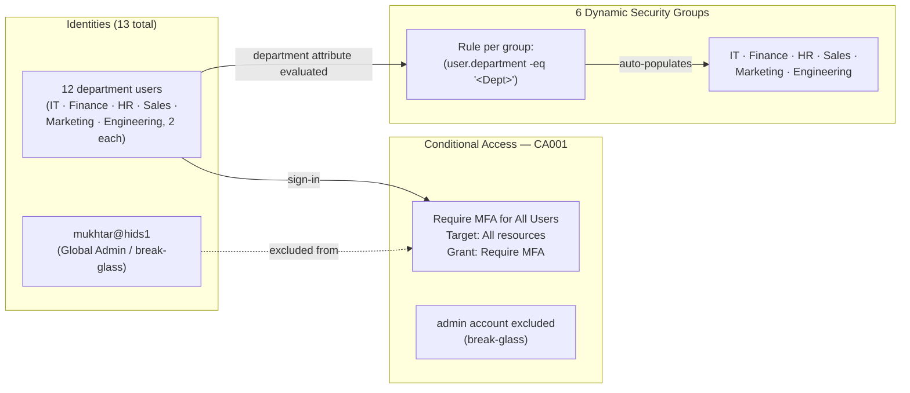

**Read it as:** membership and access enforcement both run on autopilot once a user's
attributes are set correctly at provisioning — no group is ever manually assigned, and
no sign-in reaches a resource without MFA, except the one account deliberately carved
out so an admin lockout can never happen.

## Steps

1. **Provisioned the tenant and users.** Stood up `hids1.onmicrosoft.com` with Entra ID
   Premium P2 licensing (required for dynamic groups) and bulk-imported 12 department
   users (2 each across IT, Finance, HR, Sales, Marketing, Engineering) via CSV.
2. **Built 6 dynamic security groups.** For each department, created a group with
   **Membership type = Dynamic User** and rule syntax `(user.department -eq "<Dept>")`.
   Verified via each group's Overview and Members pages that dynamic rule processing
   **succeeded** and exactly the right 2 users populated automatically — no manual
   assignment.
3. **Disabled Security Defaults.** Entra ID enables Security Defaults by default on new
   tenants, and it's mutually exclusive with custom Conditional Access policies — so
   this had to come off first, with the reason logged as "planning to use Conditional
   Access."
4. **Built the Conditional Access policy.** `CA001 - Require MFA for All Users` —
   Users: All users, Target resources: All resources, Grant: Require multifactor
   authentication — with the tenant's own admin account **excluded** from the policy
   (break-glass practice, so the policy enforcing MFA can never accidentally lock out
   the person who administers it).
5. **Enabled the policy** (not Report-only) and confirmed via the Entra ID activity
   feed: *"Successfully created 'CA001 - Require MFA for All Users'."*

## Security Outcome

Two Zero Trust / IAM controls now run without any manual per-user maintenance:

- **Group membership is self-healing.** Any future user with `department = Sales` is
  automatically a member of the Sales group the moment their profile is saved — the
  most common source of stale-access findings in a real access review is eliminated
  by design.
- **Every sign-in is explicitly verified**, not implicitly trusted, via enforced MFA —
  the core Zero Trust principle — while a deliberate, documented exception (break-glass
  admin account) prevents the control from ever becoming a self-inflicted lockout.

### Evidence notes

- **Confirmed:** all 6 groups show `Membership type: Dynamic`, `Dynamic rules processing
  status: Succeeded`, and the correct member count (2 users) on IT, Sales, and Finance
  (spot-checked directly).
- **Confirmed:** Security Defaults flipped from *"Your organization is currently using
  security defaults"* to *"Your organization is not protected by security defaults"* —
  the required precondition for CA001 to take effect.
- **Confirmed:** CA001 shows Users = All users, Target resources = All resources, Grant
  = 1 control selected (MFA), with the admin account routed to Exclude.
- **Hardening note:** a single "require MFA for everyone" policy is the starting point,
  not the finished state — a production tenant would layer additional policies (e.g.
  block legacy authentication, require compliant/hybrid-joined devices for admin
  roles, location- or risk-based sign-in conditions) rather than relying on one
  blanket rule.

## Key Concepts Reinforced

- **Attribute-based access control (ABAC) via dynamic groups** — membership is a
  computed result of user attributes, not a manually maintained list.
- **Conditional Access as the Zero Trust policy enforcement point** — access decisions
  evaluated at sign-in based on signals (user, device, location, risk), not just a
  static password check.
- **Security Defaults vs. custom Conditional Access** — the two are mutually
  exclusive; Security Defaults must be disabled before custom CA policies can run.
- **Break-glass account hygiene** — always exclude at least one admin account from a
  tenant-wide access policy so a misconfiguration can never fully lock out the
  administrator who has to fix it.
- **Least privilege at scale** — dynamic groups keep RBAC assignments accurate as an
  organization grows, without relying on someone remembering to update them.

---

## Artifacts

**Dynamic group creation & tenant-wide verification**

| Screenshot | What it shows |
|------------|---------------|
| 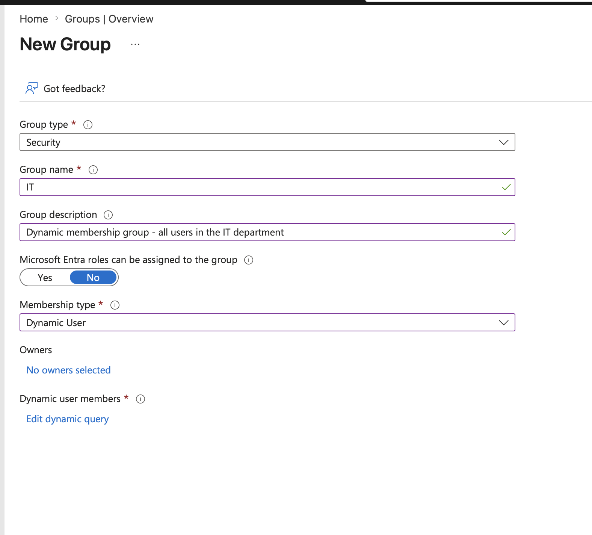 | Creating the IT group — Membership type set to **Dynamic User**, with a description documenting the rule |
| 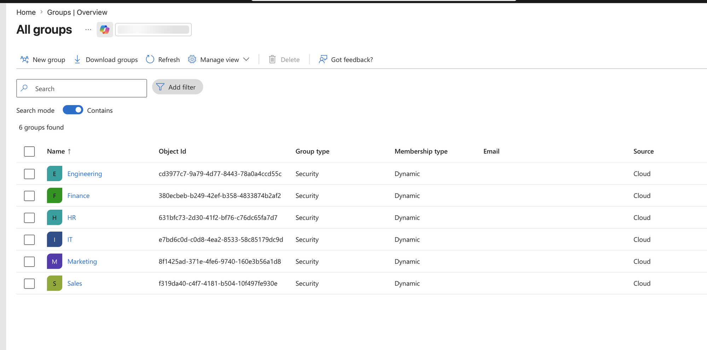 | All 6 department groups listed — Group type **Security**, Membership type **Dynamic**, confirming every group was built consistently |
| 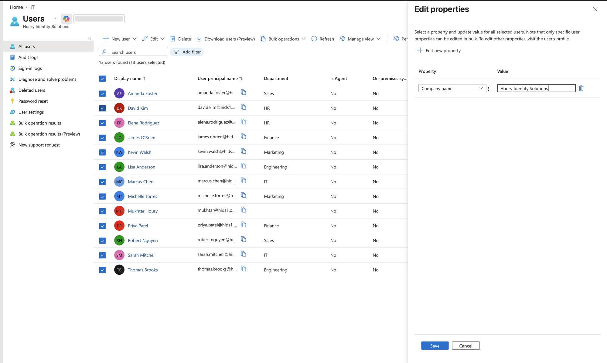 | Bulk-editing a shared property (Company name) across all 13 users in one operation — GUI-native bulk user management |

**Per-group verification — membership populated automatically from the department attribute**

| Group | Verified member count | Members |
|-------|------------------------|---------|
| IT |  | 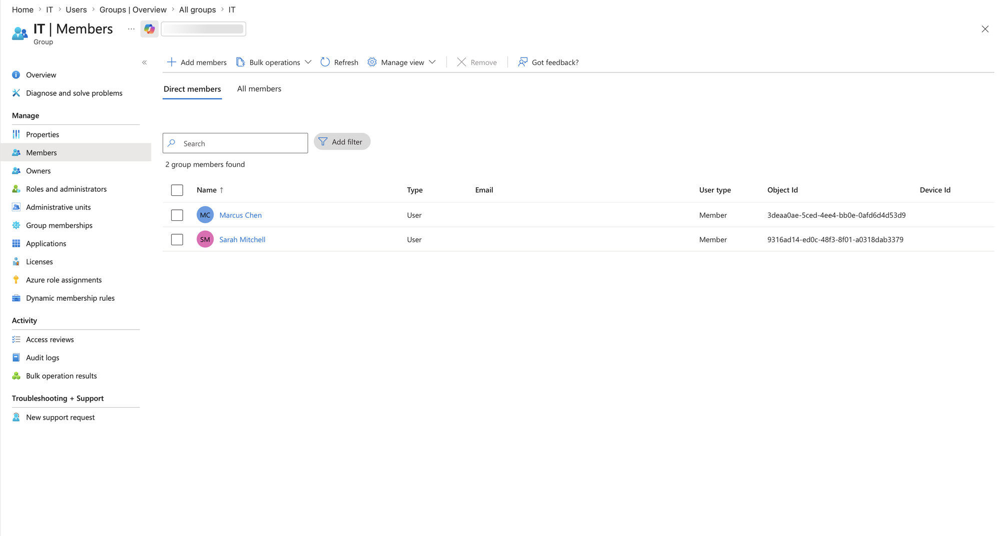 |
| Sales | 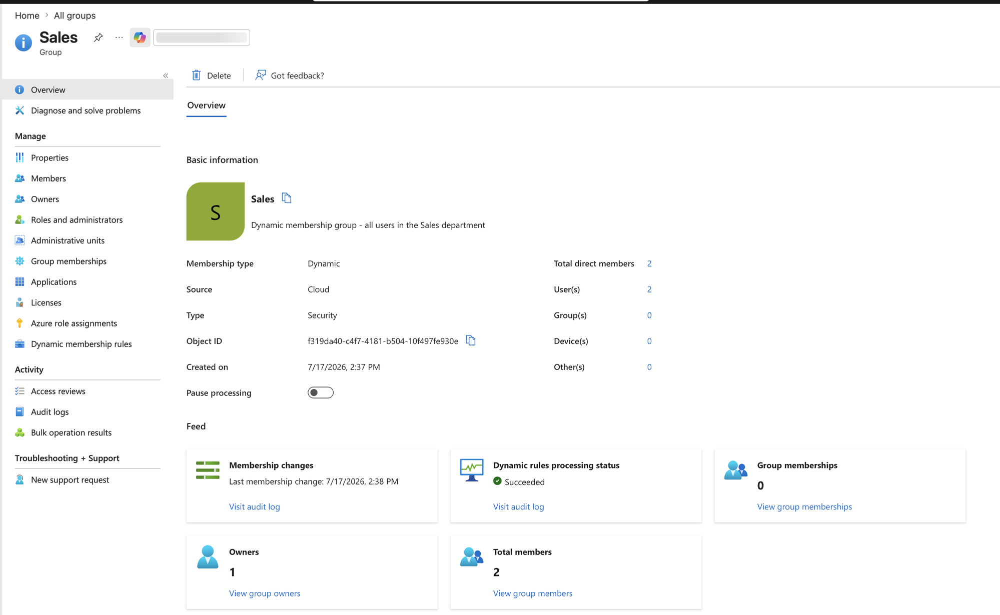 | 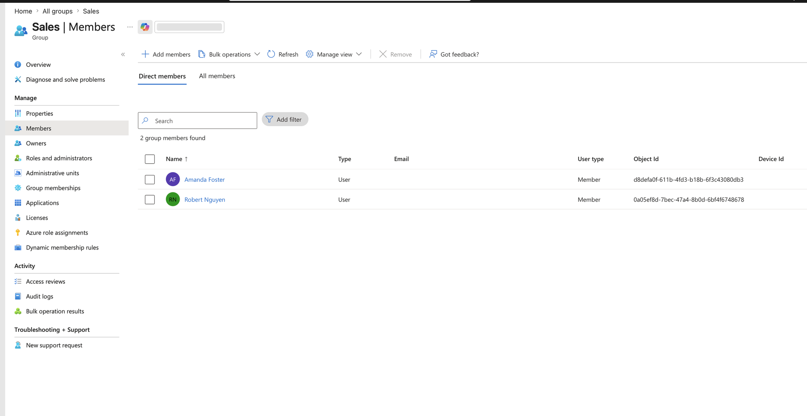 |
| Finance | 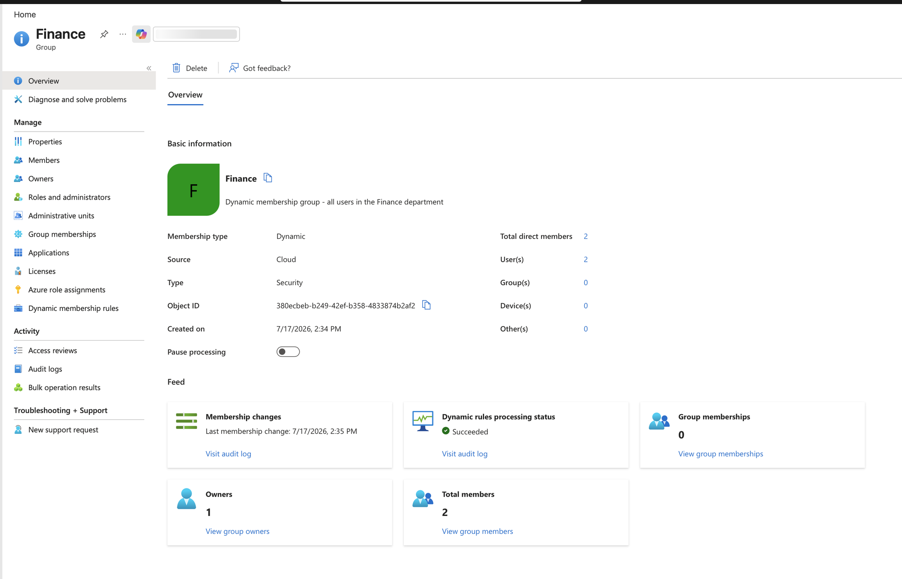 | 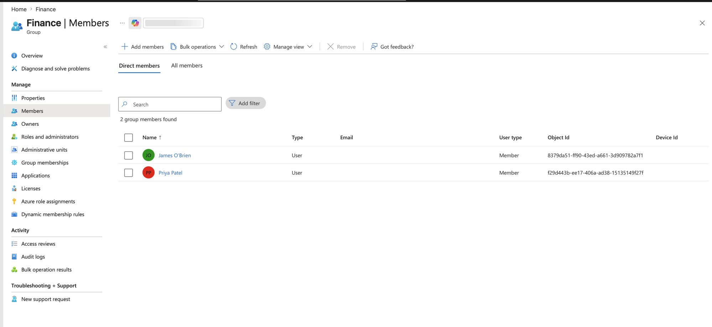 |

Each group shows **Dynamic rules processing status: Succeeded** and exactly 2 direct
members — proof the rule evaluated correctly with zero manual assignment.

**Conditional Access — before / after and final configuration**

| Screenshot | What it shows |
|------------|---------------|
| 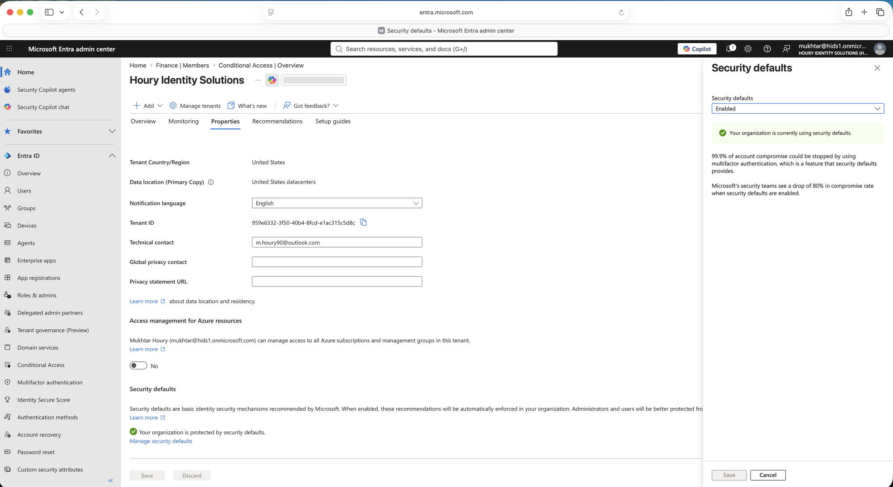 | Before: Security Defaults **Enabled** — the default state on a new tenant, and the blocker that must be cleared first |
| 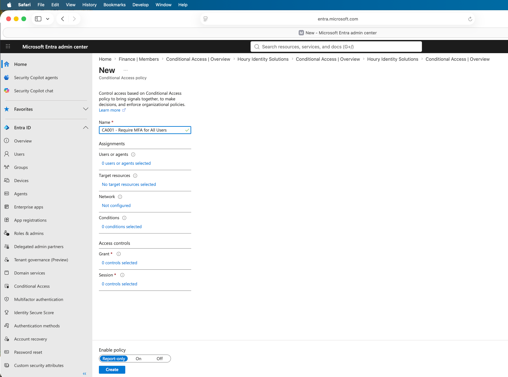 | After: *"Your organization is not protected by security defaults"* — precondition cleared for custom Conditional Access |
| 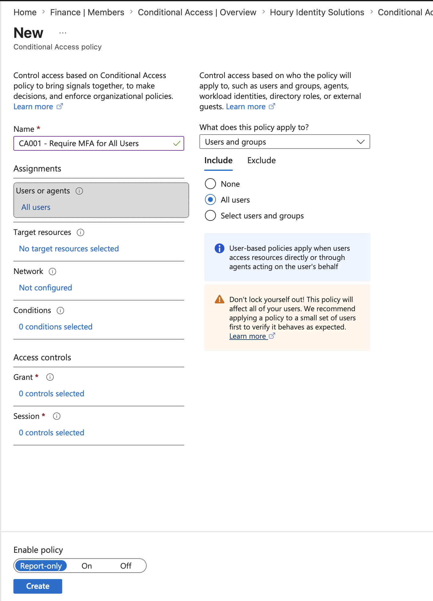 | CA001 fully configured: Users = All users, Target resources = All resources, Grant = 1 control (MFA) |
| 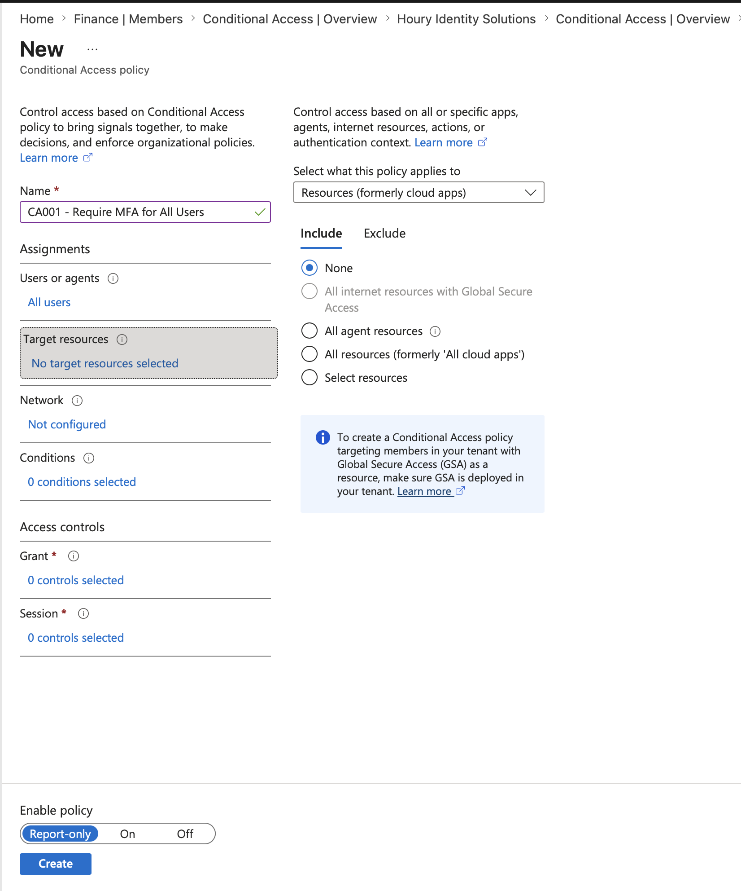 | Users assignment detail — **All users** included, with the standard "don't lock yourself out" guidance visible |
| 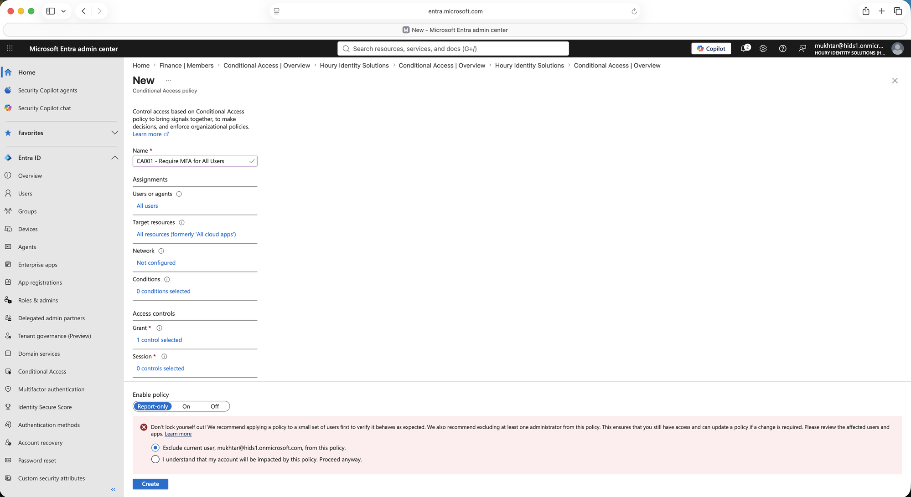 | Target resources detail — **All resources** (formerly "all cloud apps") selected |

*Lab values (the `hids1.onmicrosoft.com` tenant, its 12 department users, and the
Houry Identity Solutions display name) are non-production training data.*
