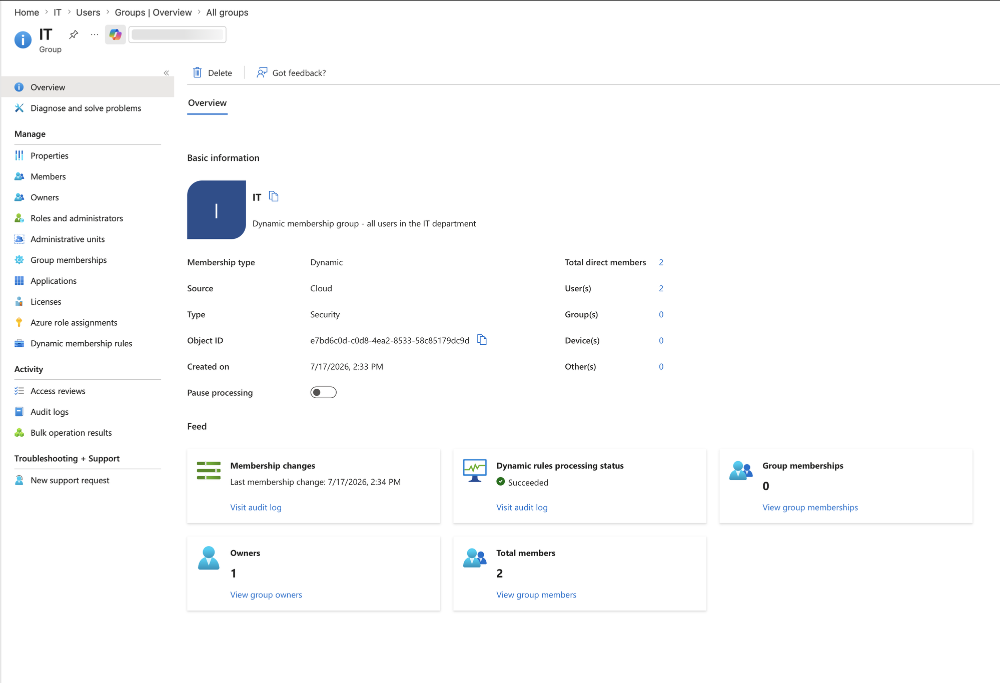

# Entra ID Dynamic Groups and Conditional Access

**Built with:** Microsoft Entra ID (Premium P2)

I've spent years granting and removing access by hand. Someone gets hired, you add them to the right groups. Someone changes teams, you remember to take the old access away, or you don't. That last part is where most stale access comes from.

I wanted to see what it looks like when the directory does that work instead of a person.

## The risk

Manual group management fails quietly. Nobody forgets to *grant* access, because the person asks. They forget to *remove* it, because nobody complains about having too much. Every access review I've read about finds the same thing: people carrying entitlements from a role they left two years ago.

The second risk is the opposite problem. Lock down authentication carelessly and you can lock every administrator out of the tenant with a single policy and no way back in.

## What I built

A live Entra ID tenant with 13 users across 6 departments, and 6 security groups whose membership is a rule instead of a list. Nobody gets added to these groups. The rule reads the user's department attribute and membership follows.

Then I turned off Security Defaults and replaced it with a Conditional Access policy requiring MFA for everyone, with one administrator account deliberately left out.

All users in this lab are fictional and the tenant was built for this project. Nothing here is production data.

## What I found

**Membership is a query, not a list.** I edited the department attribute on a user and watched the group pick them up without touching the group at all. When someone moves teams, their old access goes away because the rule stops matching, not because somebody remembered.

**Security Defaults has to come off first.** It enforces MFA, but it has no conditions and no exclusions, so you can't create a break-glass account while it's on. Turning off a security feature felt wrong until I understood it's a floor, not a control.

**The exclusion is the entire point.** A policy that requires MFA for all users, applied to all users including you, can lock every administrator out of the tenant. The excluded break-glass account is the standard safeguard, and it's the first thing I'd check on any tenant I inherited.

**Configuring something isn't verifying it.** I checked that each group reported dynamic rules processing succeeded with the right member count instead of trusting the save confirmation. That habit turned out to matter in every lab after this one.

## What I'd recommend

Drive group membership from attributes rather than assignment, so removal happens because the rule stops matching instead of because somebody remembered.

Never deploy a tenant-wide Conditional Access policy without a documented break-glass account excluded from it, and check that exclusion exists on any tenant you inherit before you change anything else.

Verify each control against what the platform reports, not against the save confirmation.

## What I'd do differently in a real environment

The department attribute would come from the HR system through automated provisioning, not from an administrator typing it. A free-text field that decides access is a data quality problem waiting to become a security problem.

I'd also layer the Conditional Access policies rather than running one blanket rule: block legacy authentication, require compliant devices for admin roles, and add risk-based conditions. One policy requiring MFA for everyone is a floor, not a finished design.

## Screenshots

| | |
|---|---|
|  | Setting an attribute on all 13 users at once. The attribute edit is the provisioning action. No group is touched. |
|  | The IT group populated from its rule. Nobody was assigned manually. |
|  | Security Defaults disabled, the prerequisite for Conditional Access to take over. |
|  | MFA required for all users and all resources, with the admin account routed to Exclude. |
