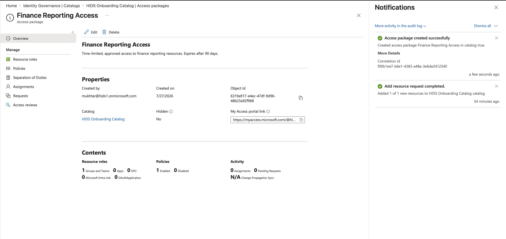
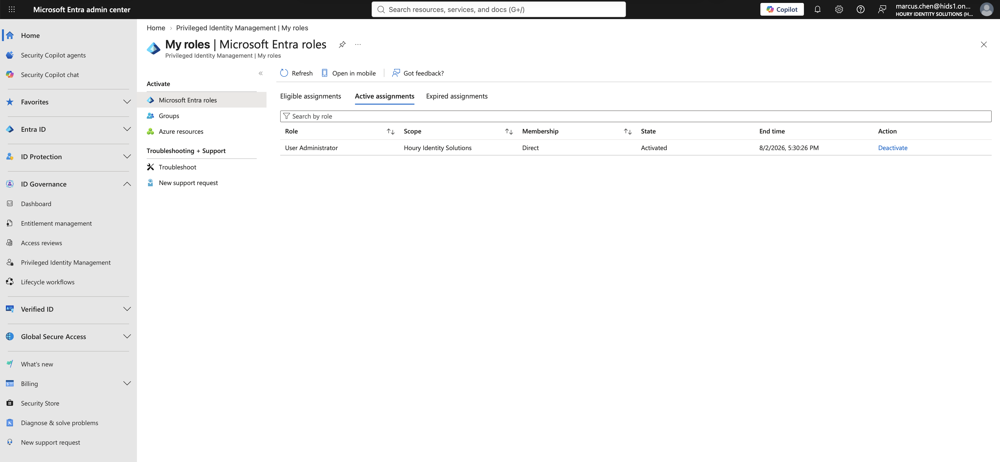
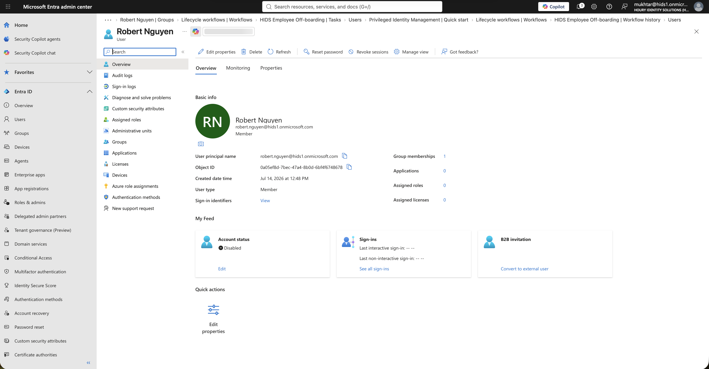

# Identity Governance and Lifecycle Automation

**Built with:** Microsoft Entra ID (P2 + Entra ID Governance)

Lab 1 automated who ends up in a group. This one is about the process around it: how somebody requests access, who approves it, when it expires, and what is supposed to happen on their first day and their last.

## The risk

When somebody leaves, the business assumes their access is gone. The evidence for that assumption is usually a status page saying the job finished.

If that status can say success while access is still live, then every termination record in the company is unverified. Nobody is going to re-check them by hand, and an auditor asking "prove these people no longer have access" has nothing to look at.

## What I built

A requestable access package with one-stage approval, a required approver justification, a 14-day decision deadline, and a 90-day expiry. A recurring quarterly access review. Just-in-time admin access through Privileged Identity Management, gated behind approval and MFA with a four-hour ceiling. And scheduled joiner and leaver workflows.

I requested the access package as a regular user rather than as an admin, because I wanted to see what the process actually feels like from the other side.

All users in this lab are fictional and the tenant was built for this project. Nothing here is production data.

## What I found

**The off-boarding said it worked and it didn't.** Six of six tasks completed, zero failures, account disabled. The user still had a group. The "remove user from all groups" task can't remove a dynamic membership, because that membership isn't an assignment, it's a rule that still matches. The log said success and the access was still sitting there.

**Then the onboarding put it back.** Eight hours later the scheduled joiner ran against that same terminated, disabled account and re-granted its baseline access. Both workflows reported zero failures. Nothing anywhere connected the two events, and nobody would have gone looking.

**The fix was the attribute, not the group.** Adding a task that clears the attributes driving membership took the account to zero groups. You can't remove rule-based access by removing the person from the group. You have to remove the reason they qualify.

**The review engine recommends from stale data.** It told me to deny an active user because their sign-in telemetry was old. I overrode it with a written justification. Recommendations are a signal, not a decision, and a reviewer clicking through them quickly is rubber-stamping.

**Eligible doesn't mean "has."** PIM gives you accountability more than it gives you authorization. An eligible assignment means someone can request elevation, not that they hold it, and that distinction is the whole product.

## What I'd recommend

Off-boarding has to clear the attributes that drive entitlement, not just remove group assignments and disable the account. Anything computed from a rule survives a removal task.

Anything genuinely privileged shouldn't be attribute-driven at all. Put it behind an access package with approval and expiry, where the grant is a decision somebody made rather than a value in a field.

Treat workflow completion status as a claim and verify it against the directory. Six of six tasks complete told me nothing.

## What I'd do differently in a real environment

I'd alert on group membership events, the adds and removes individually, rather than trusting run history. That's the only place a partial failure shows up as a fact.

I'd also want the joiner and leaver workflows to know about each other. The failure here wasn't that either one broke. It was that a scheduled joiner ran against a terminated account eight hours later and nothing existed to stop it.

## Change record

The termination above written up the way an identity team would hand it to an auditor: subject, baseline, what each run actually did, and a control verification table.

- [`LAB2-CHG-001`](evidence/LAB2-CHG-001-leaver-robert-nguyen.md) — a termination that reported six of six tasks complete while leaving access in place, then had that access restored by a scheduled joiner 8.5 hours later. 4 controls pass, 7 fail.

## Screenshots

| | |
|---|---|
|  | A requestable package scoped to an attribute-driven group, with approval, a decision deadline, and auto-expiry. |
|  | Elevation granted only after approval and MFA, with a four-hour ceiling that expires on its own. |
|  | Account disabled as expected, group memberships went from two to one instead of zero. The run still logged six of six complete. |
|  | After clearing the attributes driving membership, the dynamic group finally released the account. |
