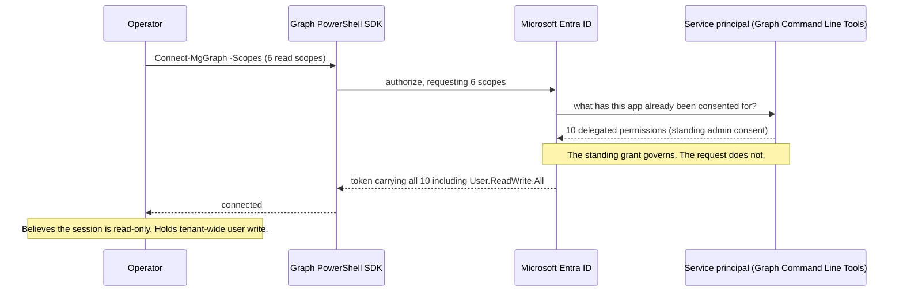
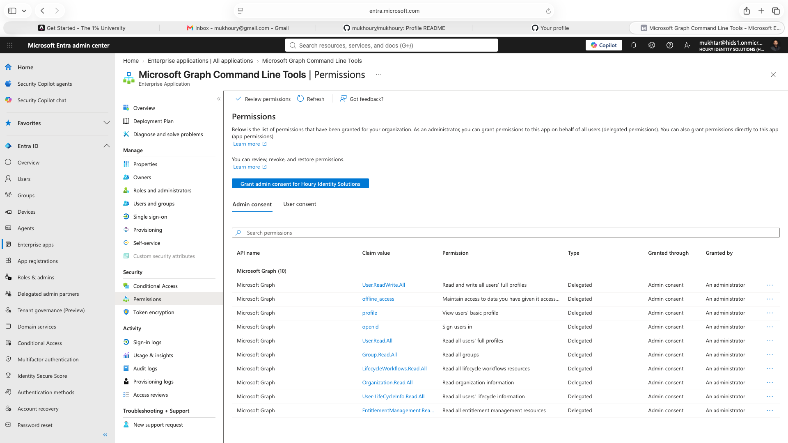
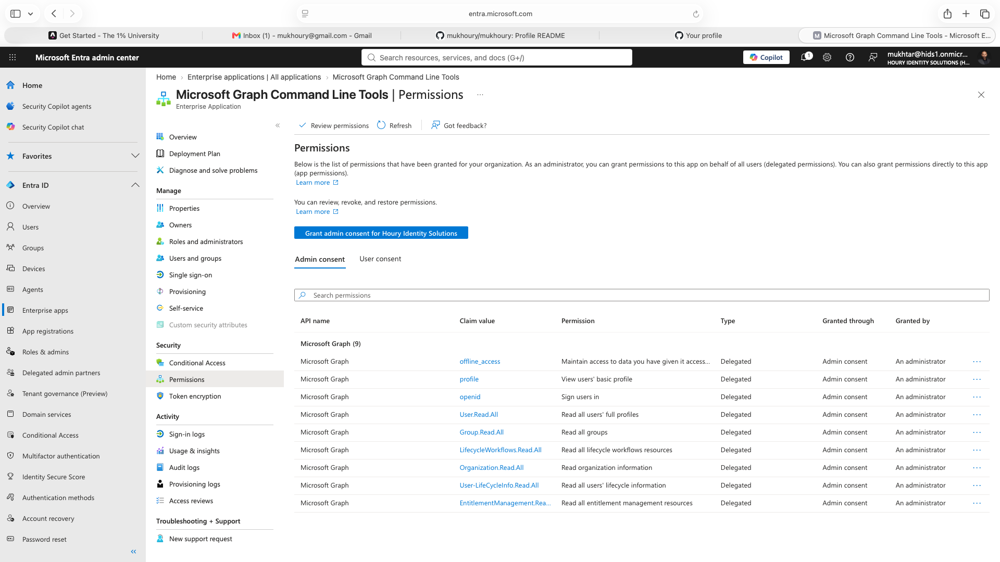
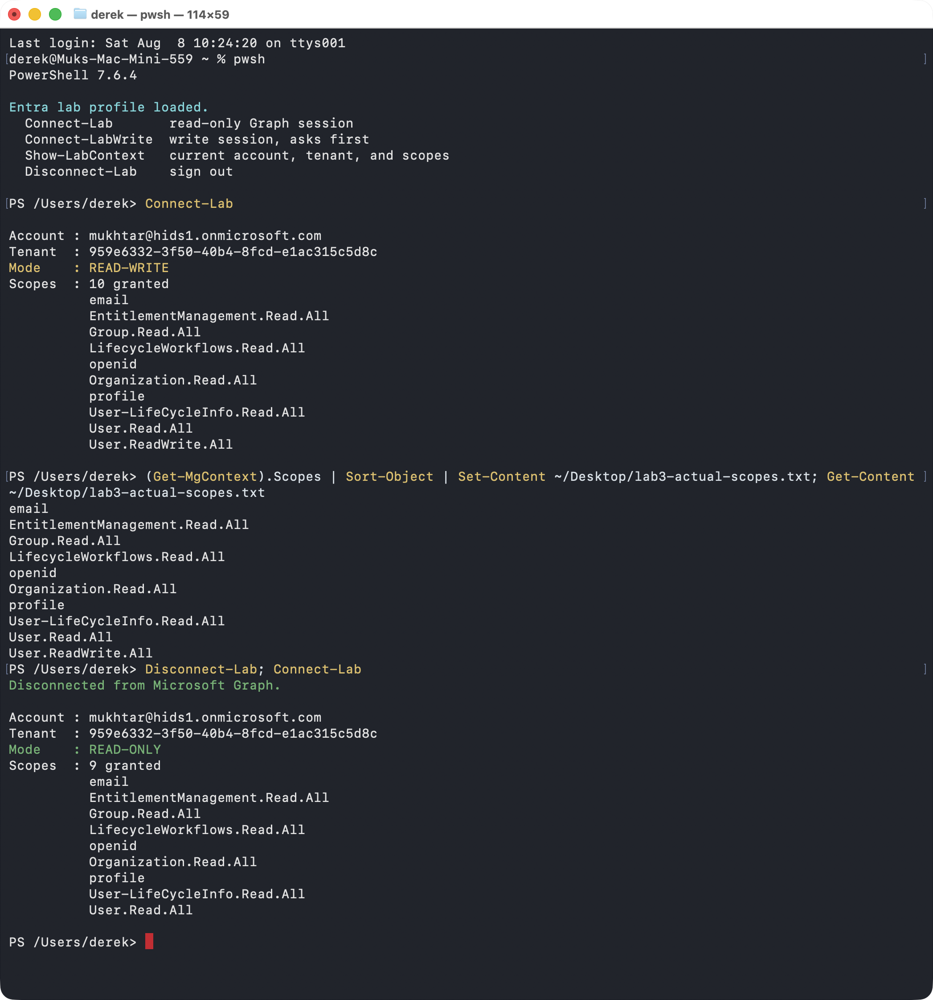
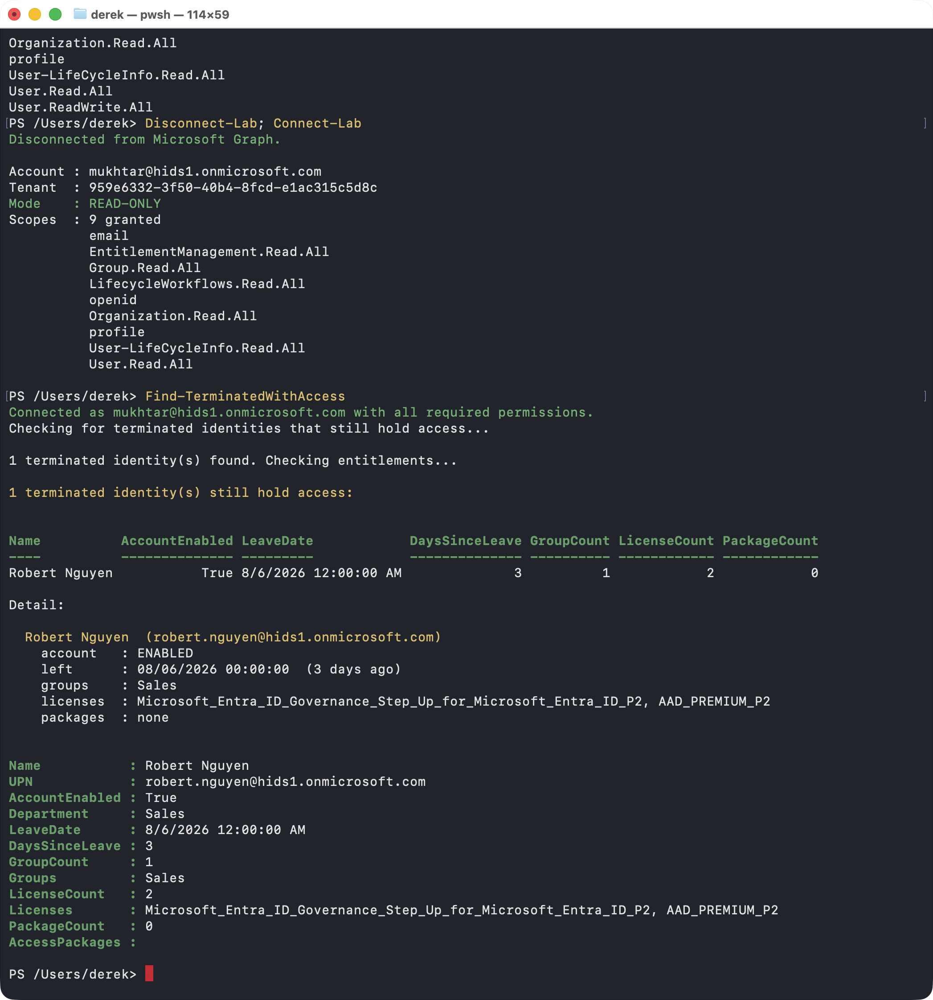
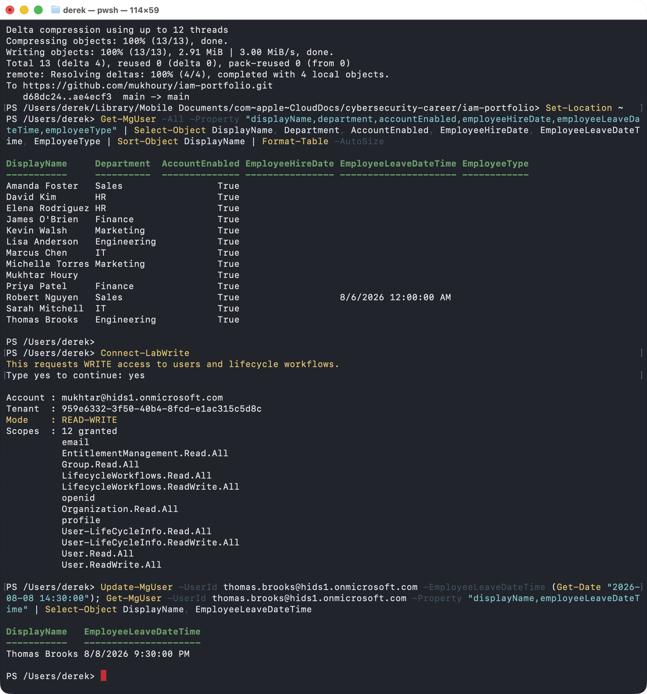

# Lab 3: Off-boarding Detection and Consent Auditing with PowerShell

**Tools:** Microsoft Graph PowerShell SDK 2.39.0 · PowerShell 7.6.4 · Microsoft Graph REST API · Microsoft Entra ID Premium P2 · Microsoft Entra ID Governance

**Domains:** Identity Governance and Administration (IGA) · OAuth 2.0 delegated consent · Detection engineering · Least privilege for application identities · Microsoft SC-300 Domains 1 and 4

**Tenant:** `Houry Identity Solutions` (`hids1.onmicrosoft.com`), 13 users, 6 departments.

---

## Problem

[Lab 2](../2-entra-identity-governance/) built the governance controls: entitlement management, access reviews, Privileged Identity Management, and joiner/leaver Lifecycle Workflows. It also produced an uncomfortable result. A leaver workflow reported **6 tasks, 0 failed** while the terminated user was still sitting in a group, and a scheduled joiner later re-granted his access at 1:13 AM without anyone noticing.

That leaves one question the portal cannot answer: **how would you ever know?**

Configuring a control is not the same as verifying it worked. Four things stand in the way of verification, and every one of them is invisible from the Entra admin center.

1. **The termination timestamp is not on the screen.** The Properties blade renders four of the five `employee*` lifecycle attributes and omits `employeeLeaveDateTime`, the one that marks a person as gone. An administrator reviewing a terminated user sees a completely normal account.
2. **There is no tenant-wide "who left but still has access" view.** The portal is built for inspecting one object at a time. Answering an auditor takes a query, not thirteen clicks per user.
3. **Nobody audits their own permissions.** A read that silently returns nothing because you lacked a scope looks exactly like a read that correctly returned nothing.
4. **The obvious detection rule is wrong.** "Terminated but still enabled" is the check almost everyone writes, and it would have returned zero rows during the actual Lab 2 incident.

## Solution

A read-only Microsoft Graph PowerShell session, a purpose-built detection script, and a deliberate escalation to write access exactly once, at the end, for the one task that required it.

- **Phases 1 through 4 are read-only by design.** Write scopes are requested a single time, in Phase 5, to bootstrap a scheduled leaver that the portal cannot create at all. That sequencing is the least-privilege story, and testing it is what produced this lab's headline finding.
- **[`Find-TerminatedWithAccess.ps1`](scripts/Find-TerminatedWithAccess.ps1)** answers the auditor's real question, *prove that everyone who left no longer has access*, by checking entitlement in three places rather than one: groups, licenses, and access package assignments.
- **The script asserts its own permissions before it trusts its own results.** It hard-stops when a required read scope is missing and warns when the session carries write scopes it never asked for.

### Why `-Scopes` does not do what it looks like it does

The central mechanism of this lab, and the reason the least-privilege plan above turned out to be unenforceable on its own:



The `-Scopes` parameter is a **request**, not a limit. Nothing in the default connect output reveals the difference.

## Steps

### Phase 1: Environment and authentication

PowerShell 7.6.4 plus five targeted Graph modules, deliberately not the `Microsoft.Graph` meta-module, which pulls in 40+ sub-modules and loads slowly. First connection made read-only with four scopes.

### Phase 2: Read what the portal hides

Queried the full set of `employee*` lifecycle attributes for a terminated user, first without `User-LifeCycleInfo.Read.All` and then with it. Verified the result against the raw Graph REST response to rule out SDK formatting.

### Phase 3: Build the detection control

Wrote and rejected the naive rule, then built the correct one. Established what Graph can and cannot answer about the past.

### Phase 4: Tooling, and auditing the session itself

Built a PowerShell profile with `Connect-Lab` (read scopes), `Connect-LabWrite` (write scopes behind a typed confirmation), and `Show-LabContext`, which prints the account, tenant, and every granted scope behind a **READ-ONLY** or **READ-WRITE** banner.

That banner was written as a convenience. It caught the biggest finding in the lab on its first real run.

### Phase 5: Just-in-time write access

Escalated to write scopes for the first time to bootstrap a scheduled leaver on a fresh subject, Thomas Brooks in Engineering. He was chosen because he carries no evidence from any earlier phase and is not in Sales, so the existing joiner workflow could not fire on him and contaminate the result.

## Security Outcome

- **A working offboarding detection control** that finds terminated identities still holding groups, licenses, or approved access packages, exportable as auditor-ready CSV evidence.
- **A standing application privilege converted to a just-in-time one.** `User.ReadWrite.All` was revoked from the Graph Command Line Tools service principal, dropping it from 10 delegated permissions to 9, after which the next write session triggered a real human consent prompt instead of connecting silently.
- **Self-verifying tooling.** A script that refuses to produce a report it does not have permission to produce correctly, because a silently incomplete audit is worse than a failed one.
- **A published finding corrected.** Lab 2's stated cause for timestamp truncation was tested against a second write path, proven wrong, and rewritten with the original reasoning left visible.

---

## Findings

### 1. A read-only request is not a read-only session

`Connect-Lab` requests exactly six read scopes. The session came back:

```
Mode   : READ-WRITE
Scopes : 10 granted
         ...
         User.ReadWrite.All
```

`User.ReadWrite.All` was never requested. Write access to every user object in the tenant, in a session explicitly asked to be read-only.

**Root cause:** Entra issues a token containing every delegated permission the application has already been consented for. Microsoft Graph Command Line Tools is a shared Microsoft first-party application, and it carried a standing tenant-wide admin consent grant from an earlier write session. Confirmed under **Enterprise applications > Microsoft Graph Command Line Tools > Permissions**, where all ten rows read `Granted through: Admin consent`. That grant is a durable directory object and it does not care what scopes you asked for today.

Every piece of guidance says connect with least privilege and step up only when needed. **That advice is unenforceable through the scope parameter alone.** An admin who connects read-only out of caution holds tenant-wide user write for the entire session, and the default connect output says nothing. The habit provides the feeling of least privilege without the fact of it.

Worth naming the neighboring row on the same blade: `offline_access`, described as "maintain access to data you have given it access to," is the refresh token. That is precisely what Lab 2's `Revoke all refresh tokens for user` task destroys. The mechanism Lab 2 built a control against is visible here from the requesting side.

### 2. The revoke does not stay revoked

Revoking the standing grant worked. Permission count went 10 to 9, `Connect-Lab` returned **READ-ONLY**, and Phase 5's `Connect-LabWrite` triggered a fresh Microsoft consent prompt where it would previously have connected silently. That is a standing application privilege converted into a just-in-time one, which is PIM's argument applied one layer down, to an application identity instead of a person.

Then, after the write work was finished, `Disconnect-Lab; Connect-Lab` came back **READ-WRITE with 12 scopes**.

**Granting write consent recreated the standing grant.** The just-in-time property survived exactly until the first time write was actually used. Genuine just-in-time application privilege needs one of two things: revoking the grant after every write session, which nobody does reliably by hand, or a dedicated app registration holding only read permissions, so the audit tooling is structurally incapable of writing no matter what the shared application has been consented for.

The second is the real answer, and it is the same reasoning as keeping a separate break-glass account instead of promising to be careful with the one you have. **Controls that depend on an operator remembering to undo something are not controls.**

There is a lesson about verification buried in the shape of this mistake. Phase 4 called the revoke a fix and verified it against a single reconnect. That verification was real, but it was taken *before* the one action guaranteed to undo it. **Verifying a control immediately after applying it only proves it applied, not that it holds.**

### 3. Graph returns lifecycle data as empty, not denied

Queried a terminated user for `employeeLeaveDateTime` while holding `User.Read.All`, `Group.Read.All`, `LifecycleWorkflows.Read.All`, and `Organization.Read.All`.

**The property came back blank. No error, no warning, no indication that anything had been withheld.** Reconnecting with one additional read-only scope, `User-LifeCycleInfo.Read.All`, and running the identical command against the identical user minutes later returned the value.

This is worse than the portal behavior. The portal at least omits the field entirely, so you can see that something is not being shown. Graph returns the property present and empty, and **there is no way to distinguish "this user was never terminated" from "you are not allowed to know."**

An administrator auditing terminations tenant-wide while holding `User.Read.All` would get a complete-looking result set with every leave date blank and would reasonably report the tenant clean. Reading full user profiles is not enough. Microsoft carves lifecycle data into its own consent scope, and the consent screen says so in its own words: *"Allows the app to read the lifecycle information like employeeLeaveDateTime of users in your organization."*

**This is why the script hard-stops on a missing scope rather than running with a gap.** A null lifecycle attribute is not evidence of anything unless the scope is confirmed present in the session.

### 4. The obvious detection rule would have missed the real incident

The rule almost everyone writes:

```
employeeLeaveDateTime is not null
AND employeeLeaveDateTime < now
AND accountEnabled = true
```

It looks correct and it returns the right user today. **During the actual Lab 2 incident it would have returned zero rows.** On Aug 4 the leaver ran, the account was *disabled*, and the user still held a dynamic group membership. `accountEnabled = true` was false, so the check reports the tenant clean while a terminated identity is still entitled.

**Disabling an account is not removing its access.** A disabled account keeps its group memberships, its licenses, and its access package assignments, and anything that re-enables it, including a scheduled joiner workflow, restores all of it instantly.

The correct rule drops the account-state condition entirely and counts entitlement instead. The question is not *can they sign in*, it is *do they still hold access*. Account state is reported as a column, never used as a filter.

The same reasoning is why the script checks three places. Groups are the obvious one and the only one most checks look at. Licenses are a cost leak as well as an access one, and the step that gets forgotten for months. Access package assignments are approved, governed access that survives independently of group membership on its own expiration clock. **A user can be clean on groups and dirty on the other two, and reporting only groups produces a confident, incomplete answer.**

First real run proved the point: a terminated user, 2 days past leave date, **enabled**, in a group, holding **two paid licenses**. A groups-only check would have reported one group and called it handled.

### 5. An offboarding failure that self-heals leaves no evidence

Graph returns **current state only**. There is no "as of" parameter, and the directory does not remember that a user went 2 groups, then 1, then 2, then 0, then 1.

Running the detector today on the Lab 2 subject returns Groups = 1 and looks unremarkable. The 1:13 AM re-provisioning of a terminated account left **no trace whatsoever on the user object**. It was caught only because someone happened to be looking that week.

Two consequences:

- **Detection must run continuously, not retrospectively.** A nightly scheduled run would have caught the reversal the following morning. Running it now catches nothing.
- **Point-in-time questions need a different source.** "What access did this person hold on their termination date" cannot be answered from the user object at all. It requires Entra audit logs, which retain 30 days on P2 and 7 on the free tier, or snapshots captured in advance. Past that window the answer does not exist anywhere.

### 6. I was wrong about the truncation, and here is how I found out

Lab 2 observed that the leaver workflow ran at 7:00 AM and stored `2026-08-06T00:00:00Z`, midnight, dropping the time despite the attribute being named `...DateTime`. I verified that against the raw Graph REST response and concluded that **Entra keeps the date and discards the time on every write**, making offboarding lag under 24 hours unmeasurable by design.

Phase 5 tested the other write path. Writing an explicit non-midnight time through Graph:

```powershell
Update-MgUser -UserId thomas.brooks@hids1.onmicrosoft.com `
              -EmployeeLeaveDateTime (Get-Date "2026-08-08 14:30:00")
```

read straight back as `8/8/2026 9:30:00 PM`. 2:30 PM Pacific is 21:30 UTC. **The time survived, stored to the minute.**

**The attribute holds full datetime precision. The Lifecycle Workflow's `Update user attributes` task writing `system.now` is what truncates.** The observation was accurate; the cause I assigned to it was not.

The corrected conclusion is narrower and considerably more useful. "The platform cannot measure offboarding lag" sounds like a limitation to accept. "The workflow task writes a date-only value, so lag is unmeasurable only on the portal-native path, and perfectly measurable through Graph" names a specific broken component and points at the workaround, which is the script.

**The lesson worth keeping:** one observation supported two explanations and I picked the wrong one because I never tested the other write path. "Verified against raw REST" proved what the stored value *was*. It never proved *why*.

### 7. Attribute-driven access self-restores; approved access stays revoked

Reinstating the Lab 2 user meant setting `department` back to Sales and re-enabling the account. Before termination he held two groups: `Sales`, a dynamic group driven by `department`, and `New Hire Baseline Access`, assigned by a joiner workflow task.

**Only `Sales` came back, and it came back automatically, with no human decision, the instant the attribute was set.** `New Hire Baseline Access` stayed revoked because an explicit grant put it there and nothing re-granted it. An access package assignment behaves the same way, requiring a fresh request and a fresh approval.

**The asymmetry is the finding: the entitlements that return for free on reinstatement are precisely the ones that never passed an approval gate.**

### 8. Half of Entra's governance surface reads attributes nobody populates

Surveying all 13 users before touching anything: **no user has an `employeeHireDate`, no user has an `employeeType`,** and only the one terminated user carries an `employeeLeaveDateTime`.

That emptiness turns out to be the root cause behind several Lab 2 dead ends that looked unrelated at the time. Manager-as-approver was unusable, group-owner-as-reviewer was unusable, and manager-as-reviewer fell through to the backup reviewer on every single request.

**A governance feature is only as good as the directory data underneath it,** and most tenants have far less of that data than they think. This is the argument for auditing attribute population as its own control, before configuring anything that depends on it.

### 9. The portal shows four of five lifecycle attributes and hides the leaver

A restored user's Properties tab renders Job title, Company name, Department, Employee ID, Employee type, **Employee hire date**, Employee org data, Office location, Manager, and Sponsors.

There is no Employee leave date field anywhere on the blade. Not on Properties, not on any tab, not behind Manage view. **The joiner attribute is visible and the leaver attribute is not.**

A user can look completely normal and completely clean on screen while still carrying a termination timestamp on the object underneath, and an administrator reviewing them in the portal has no way to know.

Related, and equally durable: re-enabling the account did not clear the **Sign in sessions valid from** stamp left by the leaver workflow's token revocation task. Harmless in effect, since it only invalidates tokens issued before that moment, but it is a permanent forensic trace of a termination that persists after the user is brought back.

### 10. A timestamp without a stated timezone is not evidence

Wrote `14:30`, read back `9:30 PM`. Nothing is broken, that is the same instant expressed in UTC, but **the SDK does not convert back to local on read** while the portal does.

An administrator who writes an afternoon timestamp and sees a seven-hour difference come back will reasonably assume the write was corrupted and go hunting a bug that does not exist. In the other direction, a leave date rendered as "8/6" in a report can actually be the evening of 8/5 locally, which changes the answer to "how many days did they retain access."

The script therefore reports `LeaveDateUtc` and `LeaveDateLocal` side by side with an explicit offset label, and normalizes both sides of the date comparison to UTC before comparing. The offset is computed rather than hardcoded, because Pacific is UTC-7 in summer and UTC-8 in winter, and hardcoding either one puts every timestamp an hour out for a third of the year, **wrong in a way that still looks plausible**.

`DaysSinceLeave` floors rather than rounds. A bare `[int]` cast rounds, so 2.6 days would report as 3. On an audit column, overstating how long someone held access after termination is the wrong direction to be wrong in.

### 11. Group-based licensing gives no way to tell "converging" from "failed"

Assigning P2 and the Governance add-on to six department groups, P2 reached 13 of 25 almost immediately while Governance sat at **5 of 25** for several minutes, and the five that worked clustered perfectly by group.

Three wrong diagnoses came first, and the reasoning that eliminated them is the useful part: a prerequisite dependency failure would scatter by user rather than land cleanly on four entire groups; the Licenses tab confirmed all six groups were submitted; and a silent failure was ruled out when it resolved on its own.

**The actual cause was asynchronous processing, and nothing in the interface says so.** Errors and Issues reported "Licensing errors (0)" and "Members without licenses (0)" while eight members of assigned groups genuinely held no license. Both statements were true at once, because that tab only reports failures among *completed* assignments. The per-group Assigned licenses column stays blank whether a group succeeded or not, so it carries no signal either.

The only feedback is a summary count that is silently wrong until it isn't, with no in-progress state anywhere. An administrator who checked once and walked away would reasonably conclude that eight assignments had broken.

---

## Key Concepts Reinforced

- **OAuth 2.0 delegated consent.** Requested scopes, granted scopes, standing admin consent, and why the token reflects the second rather than the first.
- **Just-in-time privilege for non-human identities.** The same argument PIM makes for people, applied to a service principal, including why revoking a grant once is a reset rather than a remediation.
- **Detection engineering.** Writing the rule that catches the real incident instead of the rule that sounds right, and reporting account state as evidence rather than using it as a filter.
- **Self-asserting tooling.** A control that validates its own preconditions, because a silently incomplete audit result is more dangerous than a visible failure.
- **Current state versus history.** What a directory object can and cannot tell you about the past, and why retention windows decide which questions remain answerable.
- **Data quality as a governance prerequisite.** Features that read from unpopulated attributes fail quietly and look like product bugs.
- **Timezone discipline in audit evidence.** Normalizing before comparing, labeling before reporting, and computing offsets rather than assuming them.

---

## Artifacts

The detection script is [`scripts/Find-TerminatedWithAccess.ps1`](scripts/Find-TerminatedWithAccess.ps1).

| Screenshot | What it shows |
|---|---|
|  | The root cause of finding 1. Ten delegated permissions on the shared Graph CLI application, every row `Granted through: Admin consent`, including the `User.ReadWrite.All` that was never requested. |
|  | After revoking the standing write grant. Ten permissions down to nine, all remaining entries read or sign-in scopes. |
|  | **READ-WRITE / 10 scopes** and **READ-ONLY / 9 scopes** in a single frame. Same command, same account, minutes apart. The banner that caught the finding. |
|  | First real detector run. A terminated identity, still enabled, 2 days past leave date, holding a group **and two paid licenses**. A groups-only check would have missed the licenses. |
|  | The correction in finding 6. A non-midnight time written through Graph and read straight back intact, proving the attribute holds full precision and the workflow task is the truncator. |
