# Lab 4: Hybrid Identity and Directory Synchronization

**Tools:** Windows Server 2025 Datacenter · Active Directory Domain Services · Microsoft Entra Connect Sync 2.6.84.0 · Microsoft Entra ID Premium P2 · Microsoft Azure · Windows PowerShell · Azure CLI

**Domains:** Hybrid identity · Source of authority · Directory synchronization scope as a security control · Attribute-driven access · Detection engineering · Microsoft SC-300 Domain 1

**Environment:** On-premises forest `hids.local` on a domain controller hosted in Azure, synchronized into `Houry Identity Solutions` (`hids1.onmicrosoft.com`). 15 accounts on-premises across three containers, 13 of them inside the synchronization scope.

> **Full build record:** [`BUILD-LOG.md`](BUILD-LOG.md) is the working log for this lab, written during the build rather than reconstructed afterward. It carries every wrong prediction that was made and then disproved, with the evidence that killed it. This README is the summary.

---

## Problem

Labs [1](../1-entra-dynamic-groups-conditional-access/), [2](../2-entra-identity-governance/), and [3](../3-entra-graph-powershell/) were cloud-only. Every identity was born in Microsoft Entra ID, every attribute was set there, and the Entra admin center was the system of record.

Most enterprises do not work that way. The directory of record sits on-premises in Active Directory, and the cloud is downstream of it. That single change inverts where decisions get made, and it quietly breaks the assumption every one of the earlier labs relied on: that what the Entra portal shows you is the truth.

Three specific problems come with it, and none of them are visible from the cloud console.

1. **Authority moves, and nothing tells you.** Once an object synchronizes, Active Directory owns most of its attributes. The Entra portal does not consistently disable those fields, and in at least one path it accepts an edit, reports success, and discards the value.
2. **Synchronization scope is a security control with no cloud-side evidence.** Deciding which containers synchronize decides which identities exist in the cloud at all. That decision lives in a configuration wizard on a server the auditor cannot reach, and no view in Entra represents what was left out.
3. **Off-boarding means different things on each side.** The two actions an administrator performs on a termination, disable the account and file it away, produce two completely different outcomes in the cloud, and the destructive one is the one that looks like housekeeping.

## Solution

A real single-forest Active Directory environment, synchronized with Microsoft Entra Connect Sync, then deliberately broken in three controlled ways to find out what the cloud can and cannot see.

- **Built to reproduce the common real-world failure, not to avoid it.** The forest is named `hids.local`, a non-routable domain, because that is what a large share of existing enterprises are actually running. An alternative UPN suffix was added to make synchronization possible, which is the same remediation those organizations have to perform.
- **Custom installation rather than Express.** Express settings synchronize the entire forest and never present the two decisions that matter: sign-in method and organizational unit filtering. Choosing Custom made both explicit and auditable.
- **Something was deliberately left out of scope.** The synchronization filter covers `OU=Employees` only. `OU=Service Accounts` and `OU=Disabled Users` are excluded on purpose, because a filtering lesson with nothing out of scope is a checkbox rather than a control.
- **Three experiments, each with a held control.** A soft match against a pre-existing cloud user, a search for the accounts that never arrived, and a two-step off-boarding. Every one had a baseline captured before it ran and an untouched control user alongside it.

## Steps

### Phase 1: Domain controller in Azure
Windows Server 2025 Datacenter on a `Standard_D2s_v3`. Inbound RDP exposure opened by the deployment wizard was closed immediately afterward, the private IP was pinned to static, and auto-shutdown was configured as a cost backstop.

### Phase 2: Active Directory Domain Services
Promoted to a domain controller for a new forest, `hids.local`. Time zone deliberately left on UTC. The domain name was chosen to reproduce the non-routable-domain problem rather than sidestep it.

### Phase 3: Alternative UPN suffix and directory seeding
Three organizational units built under `OU=HIDS`. Fifteen accounts seeded: thirteen employees on the routable `hids1.onmicrosoft.com` suffix, and two service accounts left on `hids.local` so they could not synchronize even if the filter were removed.

### Phase 4: Microsoft Entra Connect Sync
Custom installation. Password hash synchronization, seamless single sign-on, a dedicated `MSOL_` connector account, `mS-DS-ConsistencyGuid` as the source anchor, password writeback on, group and device writeback off, and the organizational unit filter scoped to `OU=Employees` only.

### Phase 5: Verification and source of authority
Synchronization confirmed against Microsoft Graph rather than against the portal's own success messages. Direction of authority demonstrated by an attempted cloud-side edit that silently failed and an on-premises edit that carried up in one delta cycle.

### Phase 6A: The deliberate soft match
An existing cloud-only user was recreated on-premises with a matching user principal name, joined, and then given a single changed attribute, with two other attributes held as controls. Findings verified afterward in the audit log.

### Phase 6B: Hunting the silence
Four tenant-side instruments walked in sequence to answer one question: can anything in Entra reveal that accounts exist on-premises which were excluded from synchronization. Ground truth then read directly from the domain controller.

### Phase 6C: The off-boarding test
The standard two-step termination, disable and then move to a disabled-users container, performed as two separate actions with a synchronization and an observation between them so the outcome of each could be attributed.

### Phase 7: This case study

## Security Outcome

- **A working hybrid identity environment** with a documented, auditable synchronization configuration, including every decision that was made and why the alternative was rejected.
- **A privilege escalation path from cloud infrastructure into the directory, demonstrated rather than asserted.** Twelve domain accounts were created from a laptop holding no domain credentials and no Windows password.
- **Source of authority proven by outcome**, including a portal write that reported success and wrote nothing.
- **A detection gap named precisely.** Fifteen accounts exist on-premises and thirteen reached the cloud. No instrument in Entra can produce that comparison, and the reason is structural rather than a product defect.
- **Two controls specified with their limits stated.** Alerting on group membership events catches substitutions and is blind to disabled members retaining access. Both are required and neither covers the other.

---

## Findings

### 1. Contributor on the hosting resource is Domain Admin over the forest

Remote Desktop clipboard redirection would not carry the seeding script into the guest. Rather than chase the setting, the script was delivered through the Azure control plane:

```
az vm run-command invoke -g rg-hybrid-identity-lab -n dc1 \
  --command-id RunPowerShellScript --scripts @scripts/3-seed-directory.ps1
```

Twelve user accounts were created in the domain from a macOS laptop with no domain credentials, no Remote Desktop session, no Windows password, and a broken clipboard. The only privilege held was **Contributor on the Azure resource**. The platform handed the script to the in-guest agent, which ran it as `NT AUTHORITY\SYSTEM` on a domain controller.

Directory permissions never entered the path. The code did not authenticate to Active Directory, it ran underneath it. No Active Directory access control entry, no Privileged Identity Management assignment, and no tiered administration model constrains an operation delivered that way.

**Why it matters:** a domain controller hosted as a cloud virtual machine inherits its cloud role assignments as an escalation path into the directory. Reviewing Domain Admins membership while ignoring who holds Contributor on the hosting subscription audits half the problem, and the two lists live in different systems with different owners.

### 2. A success message with no write behind it

Twelve synchronized users had a blank Company name where thirteen cloud-only users had it populated. The obvious fix was to edit them in the Entra portal. The portal accepted the input and reported success. No error, no warning, no disabled field, no note that the object was synchronized.

Checked against Microsoft Graph immediately afterward:

```
synced users WITH company set    : 0
synced users WITHOUT company     : 12
```

Nothing was written. `companyName` is one of the attributes whose source of authority moves to Active Directory once an object synchronizes, and the portal discarded every value.

This is a worse failure mode than a refusal. A greyed-out field teaches the rule the first time an administrator meets it. **A success message that silently does nothing means the administrator leaves believing the change was made**, and the discrepancy surfaces later through a report, an audit, or a downstream system reading the wrong value.

Setting the same attribute on-premises and running one delta cycle carried all twelve up within a minute. Authority runs one way, and the tool's message is a claim while the directory is the evidence.

**Attribute naming note:** the field is `company` in Active Directory and `companyName` in Entra ID. Same value, two names, which is one reason attribute mapping conversations go sideways.

### 3. The soft match joins cleanly, then the next unrelated change wipes what it stranded

An existing cloud-only user was recreated on-premises with a matching user principal name. The join linked the accounts and converted the object to synchronized. The object ID was unchanged and the original creation date survived, so it was demonstrably the same object rather than a duplicate. Every cloud-only attribute stayed intact. Everything looked correct.

Then one unrelated attribute was changed on-premises, `Department`, with `Job Title` and `Company` deliberately held as controls. `Department` updated as expected. **`Company name` was cleared in the same pass**, an attribute nobody touched, whose on-premises state was identical across both synchronizations.

Recorded as an observation rather than an explanation. The working hypothesis is that the join writes only what it is given while a subsequent modification re-exports the full attribute set, and that was not proven here.

**Why it matters:** a soft match can be validated, signed off, and look correct, and then months later one unrelated edit to one person silently clears every stranded attribute on that object, with nothing connecting the two events.

### 4. The soft match moved credential authority and ended every session

Ninety seconds after the join, three events fired within a second and a half, all initiated by the synchronization service: `Update PasswordProfile`, `Change user password`, and `Update StsRefreshTokenValidFrom Timestamp`.

The third one carries the operational weight. Moving that timestamp forward invalidates every outstanding refresh token on the account, which signs the user out of every session on every device. A real person would have been ejected from everything mid-workday with no notification and no stated cause.

Nothing in the Entra user interface surfaces this. The user blade shows a synchronized account that looks correct. The credential handover and the forced sign-out exist only in the audit log, and only if somebody thinks to look.

### 5. A membership count cannot detect an access change

This is the finding the lab is built around.

After the soft match, a single attribute was changed on-premises, `Department`, from `Sales` to `Finance`. Group memberships read **1** before the change and **1** after. The number never moved.

What actually happened is that a dynamic group keyed on `Sales` dropped her in the same operation that a dynamic group keyed on `Finance` picked her up. One in, one out, every entitlement replaced, net zero.

The instrument was chosen in advance and it was the wrong one, which is what makes it worth recording. **A total is invariant under substitution, and substitution is precisely what attribute-driven groups do.**

The audit log carries the proof. Both events, the removal and the addition, share the same **Correlation ID** `7240862c-d74d-486b-a7fb-7751fdf063e4`. A shared correlation identifier means the two were emitted by one logical operation rather than two that happened to land in the same second. Without it the claim is "her access changed twice." With it the claim is "her access was substituted," which is a different problem with a different fix.

**The correct control is to alert on membership events**, the adds and removes individually, and correlate them by Correlation ID. That is the only representation in which both halves of a substitution exist as separate facts that can be tied to one cause.

### 6. The audit record cannot tell you the group was dynamic, and names an actor that implies an approval

Both membership events reported the group target as `Group Type: unknownFutureValue` with a blank display name. That is the placeholder the Graph API returns for an enumeration value the consuming schema has no name for. In plain terms, **the audit record does not tell you what kind of group this was.**

An investigator working the incident from the audit log alone has a removal, an addition, a correlation identifier, and an actor. Nothing in the record indicates that a membership rule caused it, that no approval existed because none was possible, or that the same thing will happen again to anyone whose department attribute changes.

The actor makes it worse. Dynamic membership processing executes under a first-party service principal whose display name is **`Microsoft Approval Management`**. No request existed, no approver saw anything, and no workflow ran. The column an auditor reads to answer "who did this and under what authority" returns a string implying an authority that was never exercised.

Across thirteen audit events on that user in a full month, **not one had a human actor.**

The data an investigator needs is also present but not where they would look. The group's name appears only on the Modified Properties tab, not on Target(s). The application ID is blank on the Activity tab but populated inside Modified Properties. User Agent is empty on the group events and populated on a licensing event twenty three seconds later. No single consistent review method works across the log.

### 7. Two instruments, opposite directions, twice

Twenty three seconds after the entitlement substitution, an event fired titled **`Change user license`**, executed by a service principal, carrying a full before-and-after diff. The initial read was that the group swap had cascaded into licensing.

It had not. The same two license SKU identifiers appear on both sides of the diff, reordered, with only a `StatusUpdateTimestamp` refreshed. Nothing changed. The correlation identifier does not match the group swap, the event has no group target, and both licenses are assigned **Direct** rather than through a group, so the cascade was never mechanically available. The wrong conclusion was disproved twice, independently.

Which leaves the pairing:

- **At 5:16:52 PM**, every entitlement the user held was replaced in one operation, and the metric a reasonable administrator would monitor never moved. A real change that produced no signal.
- **At 5:17:15 PM**, a loud, well-instrumented event fired over a change that did not occur. A non-change that produced a signal.

It happened again in Phase 6B on an unrelated subsystem. The Microsoft Entra Connect blade read `Sync status: Enabled` with no warning while the domain controller was powered off, and Microsoft Entra Connect Health simultaneously reported `Error` on a server that was synchronizing correctly and had exported successfully twenty minutes earlier.

**The state of the instrument and the state of the system are independent variables.** Twice, on different subsystems, in the same lab. Any control worth relying on has to be validated against ground truth rather than trusted because it is green.

### 8. There is no query for absence, and the exclusion is invisible because it succeeded

Fifteen accounts exist on-premises. Thirteen reached the cloud. Four tenant-side instruments were walked to see whether any of them could reveal the gap.

**The user list cannot.** Every filter option under `on-premises` is a property of an object Entra already holds: SAM account name, immutable ID, last sync date time, provisioning errors, sync enabled. A filter evaluates rows, and the excluded accounts have no row. Entra also reports 13 synchronized with no denominator anywhere, so "13 out of what" is unanswerable from the cloud.

**The error control cannot, and it works correctly.** `On-premises provisioning errors` is fully usable and self-describing: selecting `Category` populates the operator and turns the value into a bounded dropdown holding exactly one entry, `PropertyConflict`, which returns zero users. Every category it offers describes an **error**. An organizational unit exclusion is a successful configuration that has executed correctly on every synchronization since it was set. Nothing failed, so nothing is reported, and nothing reads as all clear.

**The status blade cannot.** It reports sync status, last sync time, password hash sync state, and sign-in method counts. It reports no object count of any kind and makes no mention of scope, filtering, or organizational units. It would render identically whether the filter passed 13 objects or 13,000.

**Connect Health cannot either.** It reports server status, alert history, and sync errors, and shows no object counts or scope.

**And the accounts left out are the privileged ones.** `svc-backup` and `svc-monitoring`. A backup identity needs to read everything and a monitoring identity needs to see everything. That is not an artifact of how this lab was seeded, it is the normal shape of the problem, because service accounts are exactly what administrators exclude from synchronization. The identities least covered by Conditional Access, cloud access reviews, risk detection, and Privileged Identity Management are the ones that would matter most in an incident.

**Removing the filter would not fix it.** Both service accounts carry `@hids.local` user principal names, and `.local` cannot be verified in Entra because nobody can prove ownership of it. Two independent blockers. An administrator who finds the gap and reaches for the obvious remedy will widen the filter, synchronize, see nothing arrive, and be debugging a second cause they did not know existed.

### 9. "Enabled" describes intent, not activity

The Connect Sync blade reported `Sync status: Enabled` in plain text with no warning, no amber state, and no advisory, at a moment when the domain controller had been deallocated overnight and roughly 28 consecutive synchronization cycles had not run.

In this lab the machine was powered off deliberately to control cost, so the gap was harmless. Nobody deallocates a production domain controller. In a real environment that identical screen would mean something failed overnight, and it would still read `Enabled`. The page cannot distinguish a deliberate shutdown from an outage because it is not reporting on either one.

The same page also does not auto-refresh and gives no cue that its numbers are stale. `Last sync` read `14.00 hours ago` for over twenty minutes after a successful synchronization, because the value was fetched when the tab was first opened and never updated. A tab left open reports synchronization state frozen at the moment it was opened.

Answering the underlying question also required leaving the Entra admin center for the Azure portal, because virtual machine power state is not an identity object. **The synchronization engine's health depends on infrastructure the identity console cannot see.**

### 10. Disabling an account revokes authentication and nothing else

A user in the `Sales` dynamic group was disabled in Active Directory and synchronized. The cloud account status flipped to `Disabled` correctly.

Nothing else changed. Still a member of `Sales`, same group object ID, no substitution. Still holding two licenses. Still carrying `Department = Sales`.

The rule is `user.department -eq "Sales"`. It tests department. It does not test whether the account is enabled, and termination does not clear an attribute, so a disabled and terminated employee continues to satisfy the rule and continues to hold the entitlement. He cannot sign in. That is the entire effect of the action an administrator understands as revoking access.

**Three consequences worth stating separately.**

The disable produced **no membership event at all**. The group's own overview still showed a last membership change from the previous day. Correct behavior, and precisely the problem: the control recommended in finding 5, alerting on membership events, is blind to this entire class of stale access because nothing is emitted.

The group members list **has no account status column**. Name, Type, Email, User type, Object Id, Device Id. An access review scoped to that group presents a terminated employee to a reviewer as an ordinary current member, rendered identically to active staff. The control designed to catch stale access cannot display the most common form of it.

And the reversal is instant. One `Enable-ADAccount` and one synchronization restores a fully entitled identity, with no approval, no review, and no record that anything was granted.

### 11. Moving a user between folders deletes the cloud identity, and the record does not say why

The second half of the standard off-boarding is to file the account into a disabled-users container. That container is outside the synchronization scope.

After the move and one delta cycle, the user returned **`0 users found`** in Entra and the tenant went from 25 users to 24. Not disabled. Not flagged. The object no longer exists. The `Sales` group dropped to two members with no removal event, because a membership cannot be removed from a member that does not exist.

So the two-step off-boarding did this. **Step one, disable:** blocked sign-in, revoked no entitlement, released no license, emitted no event. **Step two, move to a folder:** deleted the cloud identity, released the licenses, removed the group membership. The action an administrator calls revoking access did almost nothing. The action they call tidying up did everything, and it is the destructive one.

**The deletion record points at the wrong event.** `Deleted date time` records the moment the synchronization ran, not the moment a human moved the object two minutes earlier, on a server that emits nothing into the cloud audit trail. An investigator six months later sees an account deleted by the synchronization service and finds nothing anywhere explaining the cause.

**The user principal name is also rewritten on delete.** The address is replaced with the object ID and preserved separately under `Original user principal name`, freeing the address for immediate reassignment. A restore may need the UPN repaired, and the freed address can be handed to a new account while the old one is still recoverable.

### 12. The deletion threshold protects against the mistake nobody makes

The export deletion threshold was left at its default of 500. The deletion above passed straight through with no prompt, no warning, and no confirmation.

That threshold exists because organizational unit filtering makes mass deletion a plausible accident, and it does protect against removing five hundred people at once. It offers nothing at all against removing **one** person, which is both far more likely and far less likely to be noticed. A safety net calibrated for catastrophe does not catch the routine error.

---

## Key Concepts Reinforced

- **Source of authority.** Which directory owns an attribute, how that ownership moves on synchronization, and why a portal success message is not evidence that a write occurred.
- **Soft matching.** How an incoming on-premises account links to an existing cloud object, what the join preserves, and what it silently strands.
- **Password hash synchronization.** What it takes over at the moment of a join, including refresh token invalidation and the forced sign-out that follows.
- **Organizational unit filtering as a security control.** Scope decides which identities exist in the cloud, and the decision has no representation on the cloud side.
- **Attribute-driven access.** Dynamic membership rules re-derive entitlement continuously from fields that terminations do not clear.
- **Correlation ID as the causation test.** The difference between two events near each other in time and one operation that produced both.
- **Soft delete and the 30-day recovery window**, including user principal name rewriting on deletion.
- **Two separate permission planes.** Azure RBAC governs the resource, Entra ID roles govern the directory, and on a domain controller the first one reaches the second.
- **Reconciliation against source.** The only control that produces a denominator the cloud cannot supply on its own.

## Evidence

| | |
|---|---|
| 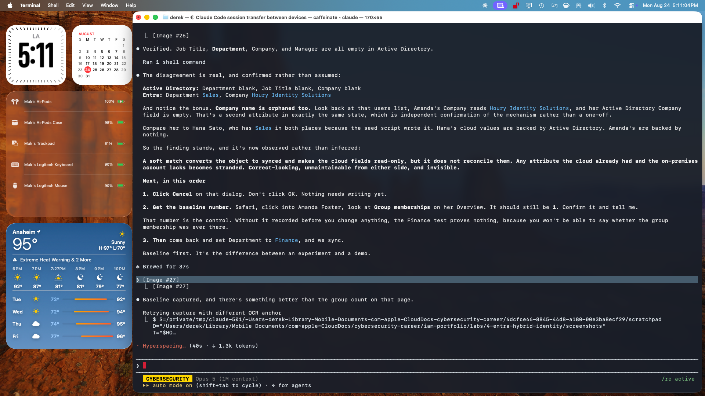 | **Soft match, same object.** After the join. Object ID and creation date unchanged, so the match linked rather than duplicated. Group memberships reads **1**, the number that would go on to hide a total entitlement substitution. |
| 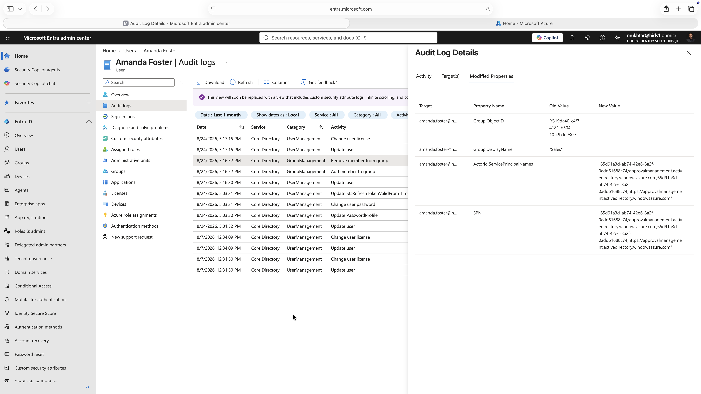 | **Sales removed.** `Group.DisplayName` old value `Sales`, new value blank. Entra records an entitlement removal as a property going to nothing, so what somebody lost is readable only in the old value column. |
| 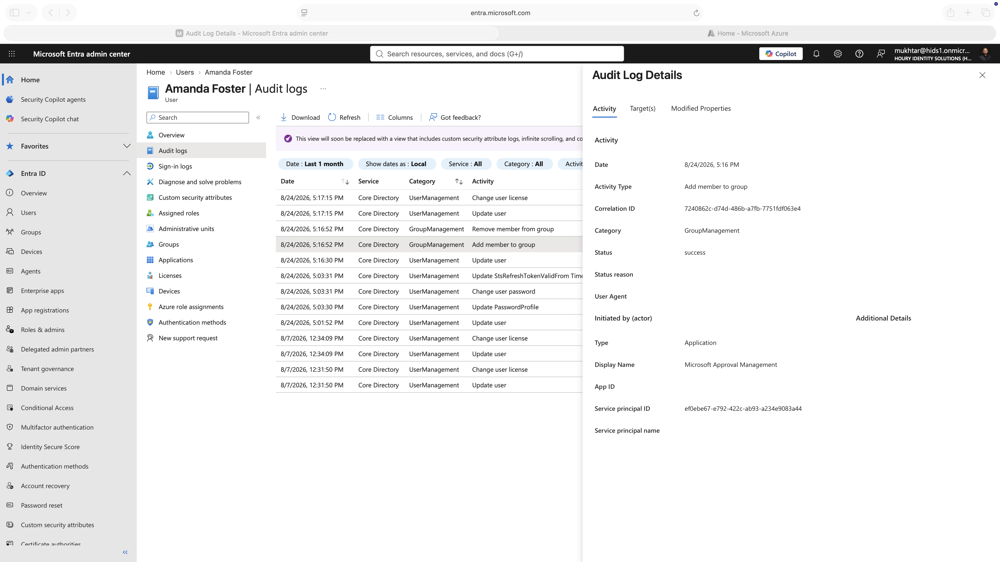 | **Correlation ID match.** The addition event carrying Correlation ID `7240862c-d74d-486b-a7fb-7751fdf063e4`, identical to the removal. One operation, not two coincidences. This is what turns *her access changed twice* into *her access was substituted*. |
| 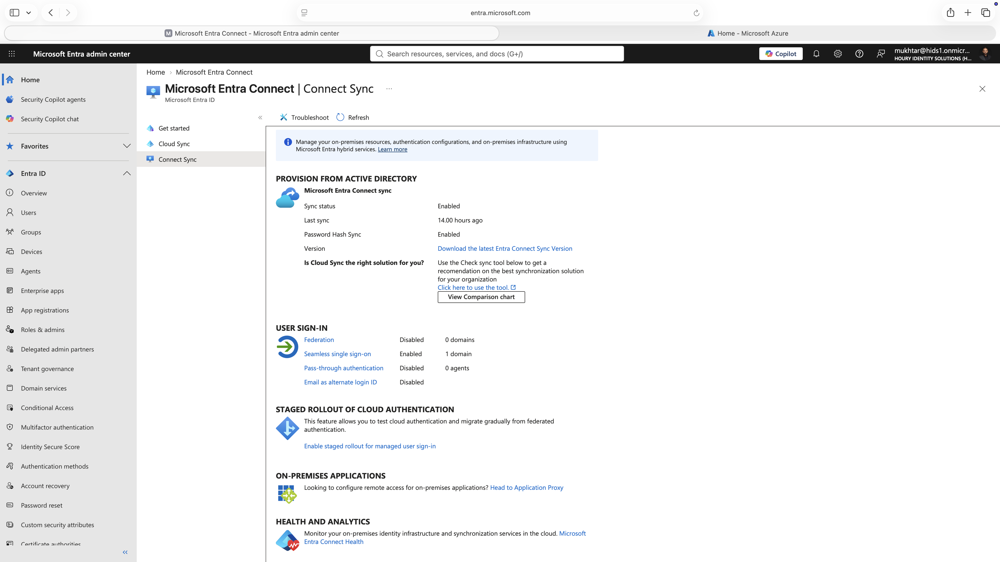 | **No object count anywhere.** The synchronization status blade. Sync status, last sync, password hash sync, sign-in method counts. **No object count of any kind**, and no mention of scope, filtering, or organizational units on the page. |
| 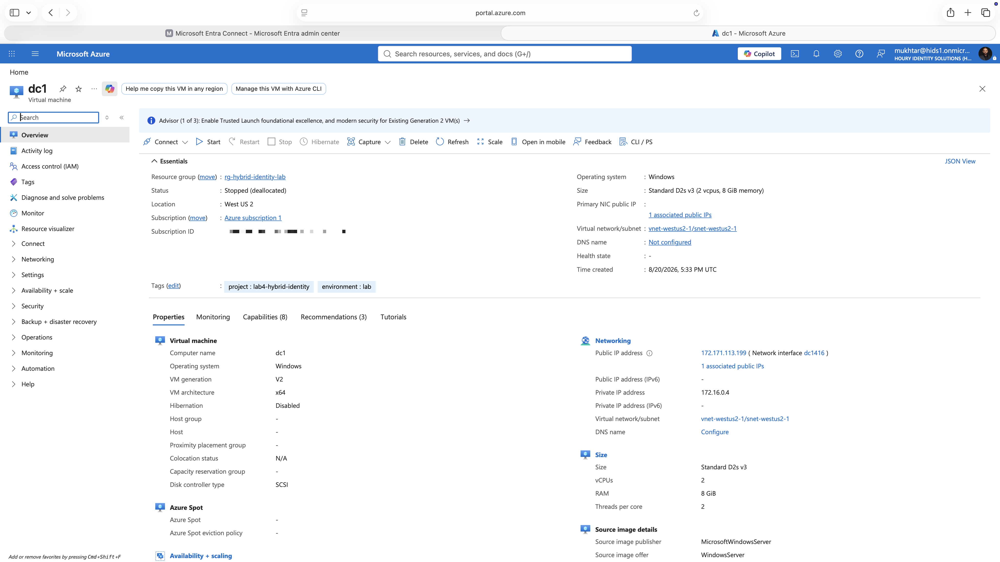 | **Enabled while powered off.** `Sync status: Enabled` with no warning, at a moment when the domain controller had been deallocated overnight and roughly 28 synchronization cycles had not run. |
| 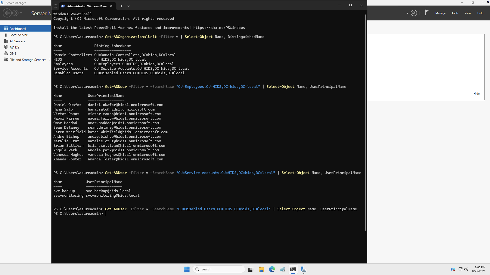 | **The denominator the cloud cannot produce.** Read directly from the domain controller. 13 employees, 2 service accounts on `hids.local` user principal names, 0 in the disabled container. **15 exist, 13 reached the cloud.** |
| 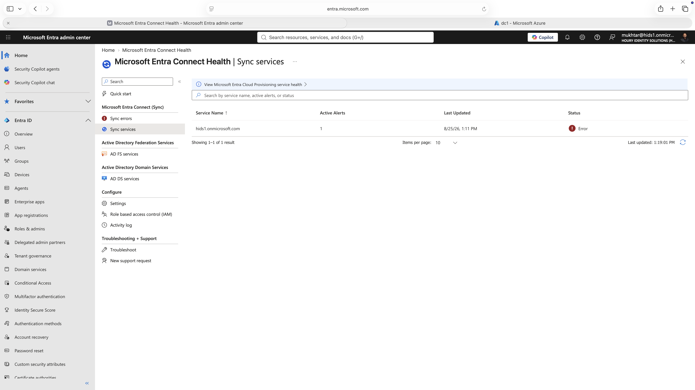 | **Two consoles, opposite verdicts.** Connect Health reporting `Error` with one active alert against the same server the Connect blade called `Enabled` minutes earlier. |
| 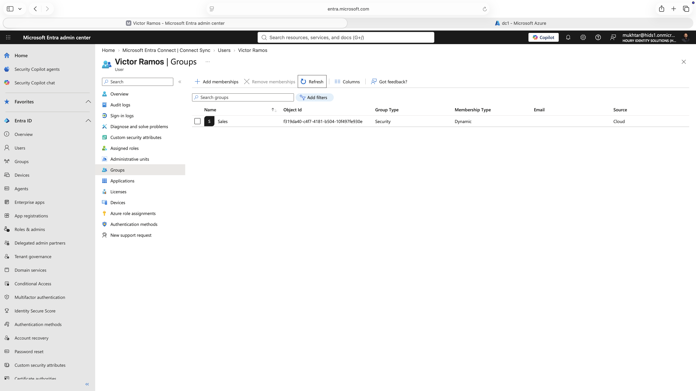 | **Disabled and still entitled.** A disabled, terminated account still holding membership in the `Sales` dynamic group, same group object ID as before the termination. |
| 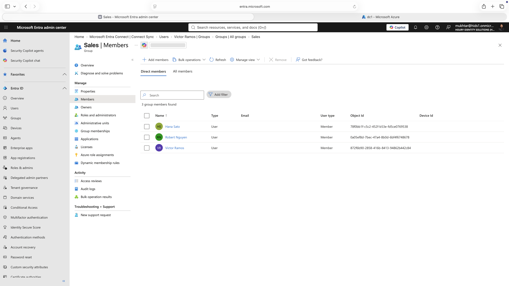 | **No account status column.** The group members list. Name, Type, Email, User type, Object Id, Device Id. **Nothing shows whether an account is disabled**, so an access reviewer cannot tell an active employee from a terminated one. |
| 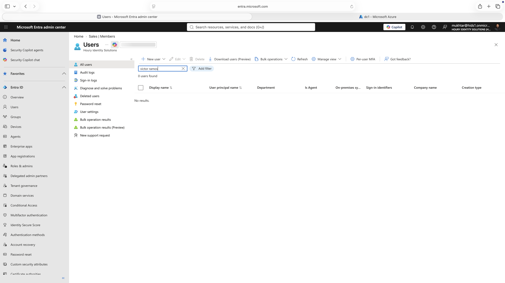 | **Deleted, not disabled.** `0 users found`. Moving the account into an out-of-scope container deleted the cloud identity outright, and the tenant went from 25 users to 24. |
| 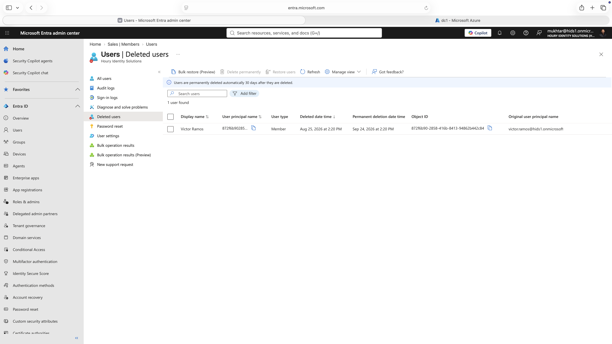 | **The deletion record.** Timestamped to the synchronization rather than to the human action two minutes earlier. The user principal name is rewritten to the object ID, with the real address preserved separately under `Original user principal name`. |

Full capture set, including the phases not shown here, is in [`screenshots/`](screenshots/).
## Artifacts

- [`BUILD-LOG.md`](BUILD-LOG.md) — the full working log, written during the build, including every wrong prediction and the evidence that disproved it
- [`RUNBOOK.md`](RUNBOOK.md) — the build sequence in operational order
- [`scripts/`](scripts/) — directory seeding and supporting automation
- [`screenshots/`](screenshots/) — captured evidence for each finding
